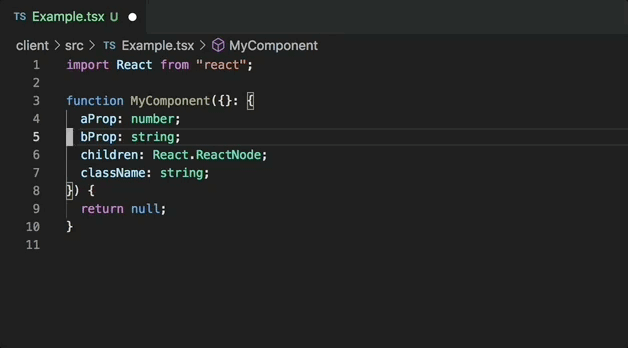

# Paul's TypeScript Toolkit

VSCode extension with a collection of React and TypeScript utilities

## Features

- TypeScript refactor: Extract type literal properties to object binding pattern.

## Installation

Get the extension on the Marketplace.

https://marketplace.visualstudio.com/items?itemName=paulshen.paul-typescript-toolkit
